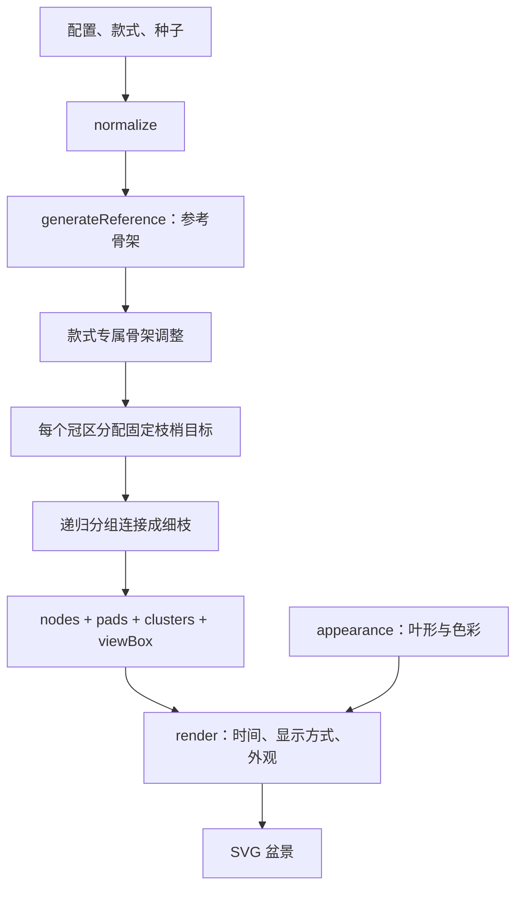

> 应用已接入本文算法的冻结副本，最新生命周期、修剪、持久化和部署范围见 [应用 MVP 实现](应用MVP实现.md)。本文记录研究原型的几何与渲染实现，研究入口现为 /research.html。

# 盆景算法当前实现

记录日期：2026-09-16。当前代码版本：`canopy-study-2`。本文件对照当前源码记录首页原型的实际行为，作为后续开发入口；早期文档中的提案和旧工作台算法不等同于本实现。

## 1. 实现范围

当前原型是**可复现的二维盆景造型生成器**：使用预先设计的成熟骨架，在冠区内分配枝梢目标，递归生成分级细枝，再绘制有体积的叶簇。已实现七款树形、六套视觉方案、独立外观搭配、参数评审和候选保存。

时间轴展示预生成结构的逐步展开。当前首页没有接入剪枝、芽竞争、资源分配、光照反馈或真实生理生长；“96h”是实验动画时间，不是植物生长预测。

| 入口 | 实现 | 状态 |
|---|---|---|
| `/` | `canopy-study-2`：冠区目标、分级枝序、体积叶簇 | 当前评审原型 |
| `/selection-v1.html` | `specimen-study-1`：六款树形 × A/B/C 策略 | 保留对照及原候选 |
| `/workbench.html` | 芽竞争、风格生长和剪枝实验 | 旧工作台，独立运行 |

正式产品设计中的 Render、Neon、多人协作等没有接入此原型。当前由本地 Node 静态服务器提供页面，候选保存在浏览器本机。

## 2. 源码入口与数据流

| 文件 | 职责 |
|---|---|
| [`canopy.mjs`](../prototype/canopy.mjs) | 配置归一化、七款造型、参考骨架变换、冠区和细枝生成、SVG 绘制 |
| [`appearance.mjs`](../prototype/appearance.mjs) | 叶形、叶色、树干色、背景及六套组合的枚举和默认值 |
| [`canopy-study.mjs`](../prototype/canopy-study.mjs) | 款式/配色对照、调参、缓存、候选读写与导出 |
| [`specimens.mjs`](../prototype/specimens.mjs) | 提供旧版完整模型；新版提取其主干、主枝和冠区作为基础 |
| [`model.mjs`](../prototype/model.mjs) | 新版复用 `sample()` 确定性采样与 `pointOn()` 三次贝塞尔求点 |
| [`style-render.mjs`](../prototype/style-render.mjs) | 新版复用 `taperedPath()` 变宽枝干轮廓 |
| [`index.html`](../prototype/index.html)、[`canopy.css`](../prototype/canopy.css)、[`study.css`](../prototype/study.css) | 页面结构及手机/桌面布局 |



`generate(config)` 一次性生成整棵模型；`render(tree, options)` 不修改该模型。切换叶色、树干色、背景和叶形不会改变 `nodes`、`clusters` 的位置或画幅。

## 3. 七款骨架

普通款式调用旧生成器的 C 混合策略取得参考。新版丢弃旧细枝，保留成熟主干及主枝；参考的控制点、主干半径和冠区位置仍由 `specimens.mjs` 的 `PRESETS` 定义。

| id | 款式 | 默认冠区 | 每区枝梢 | 主要差异 |
|---|---|---:|---:|---|
| `juniper` | 分层真柏 | 6 | 12 | 曲干、错落横展的鳞叶冠 |
| `broom` | 圆顶榉树 | 7 | 16 | 共享主枝、连续阔叶圆冠 |
| `literati` | 文人松 | 5，可选 3–6 | 8 | 长裸干、中上部小冠、较小盆 |
| `pine` | 直干黑松 | 6 | 12 | 直立收尖、针叶层、矩形盆口 |
| `slant` | 斜干松 | 6 | 12 | 倾斜骨架、两侧枝冠、青灰盆 |
| `cascade` | 悬崖真柏 | 4 | 10 | 向下延伸的成熟骨架、深盆 |
| `windswept` | 风吹松 | 5 | 10 | 单向偏冠、扁长叶层、浅盆 |

专属处理：

- **榉树**：把旧版七条放射主枝按 `[0,1]`、`[2,3,4]`、`[5,6]` 分成三组，先建立共享的 `bough`，再接回各组主枝。这样形成两级骨架，减少伞骨般的一点放射。
- **文人松**：保留原有三冠；`crownCount > 3` 时按固定顺序增加最多三条成熟主枝及冠区。新增枝有轻微种子扰动，位置集中在中上部，不填满下部裸干。
- **斜干松**：从直干黑松参考模型出发，对所有曲线控制点和冠区中心统一执行 `x' = x - 60 + (rootY - y) × 0.43`，根的 x 同时减 60。新旧对照使用同一变换后的骨架。
- **风吹松**：冠区和叶簇横向乘 `1.12`，纵向乘 `0.8`；绘制针束时额外加入 `0.75` 弧度的偏向。

树种名称表达造型和美术参考，未实现各树种的生理差异。

## 4. 冠区目标与递归枝序

### 4.1 分配目标

每个冠区的枝梢数为：

```text
N = round(preset.tips × tipScale)
```

每个目标最终对应一个末端细枝及一个叶簇。

- 阔叶冠使用黄金角 `2.3999632297` 和半径 `sqrt((j + 0.5) / N)` 在椭圆内分布目标。
- 松柏冠使用三排目标；越高的一排横向越收窄，中间排稍有错位，形成较平的下缘和收拢的顶部。
- 位置加入小幅确定性扰动。`padScale` 同时缩放冠区和叶簇半径，但不移动成熟主干及主枝。
- 冠区带有前后排序值 `z`，叶簇在其基础上加入小幅深度变化。这只是绘制层次，不是三维空间坐标。

### 4.2 连接成枝

每个枝系从所属主枝曲线的 `t = 0.58` 处开始。递归规则如下：

```text
divide(parent, start, targets, depth):
    if 只剩一个目标:
        建立 start → target 的末端细枝
        在末端绑定一个叶簇
        return

    center = targets 的平均位置
    end = start + 0.56 × (center - start)
    建立 start → end 的细枝
    找到 targets 在 x / y 中跨度较大的轴
    沿该轴排序并分成两半
    从 end 分别递归连接两组
```

因此每个冠区产生 `2N - 1` 段细枝。细枝数量由目标预算直接决定，不再让许多独立枝系在同一冠区内反复分叉。这里没有空间殖民算法中的吸引点消耗，也没有运行时的光照或碰撞搜索。

每段细枝为三次贝塞尔曲线，两个控制点约位于位移的 `0.3` 和 `0.72` 处，叠加一次有界横向弯曲。宽度逐级递减，受父枝末端宽度限制；末端枝进一步收尖。

当前规则并不保证二维投影完全无交叉，也没有“所有新枝必须向上”的全局限制。造型主要由骨架、目标分组和有限枝梢预算控制。

## 5. 叶簇与单叶

`clusters` 是树冠中间尺度，不是单片叶子。每个叶簇通过 `node` 指向实际末级枝，中心等于该枝的终点。

### 5.1 体积

叶簇轮廓由 16 个带小幅径向扰动的点构成，用二次贝塞尔连接为圆滑闭合形。基础半径如下，之后再乘 `padScale`、种子微扰和款式的长宽系数：

| 骨架叶类 | 横向半径 | 纵向半径 |
|---|---:|---:|
| 阔叶 | 22 | 20 |
| 针叶 | 16 | 12 |
| 鳞叶 | 19 | 15 |

`coverage >= 0.6` 时绘制叶簇核心色块，再覆盖单叶细节；低于该值只保留散布的叶片。核心透明度随覆盖度变化。轮廓由多个叶簇交叠而成，尚未实现连续隐式密度场。

### 5.2 细节与明暗

叶片按 `sqrt(random)` 半径在叶簇椭圆内取样，数量约为 `round(K × coverage)`：阔叶形 K 为 37，针束为 40，鳞叶为 48。这里的“针束数量”不等于单针数量，每束画三根针。

叶片明暗由簇内纵向位置主导，再加小幅随机变化，从四级颜色中选取。上方通常较亮，下方较暗，避免每片叶子完全独立挑色产生噪点。

`leafScale` 只控制叶片或针束的显示尺度，不改变叶簇半径或枝干。圆叶、椭圆叶、细长叶、掌状叶、扇形叶和针束使用不同 SVG 几何；不会因换叶形重新生成骨架。

## 6. 枝干接缝、根颈与绘制层次

### 6.1 连续枝干

`taperedPath()` 采样中心曲线，按局部法线和逐渐变化的宽度生成两侧轮廓。相邻枝段原本只以平口相接，可能因抗锯齿露出细缝；现在在起点和当前终点绘制同色圆帽，以重叠填充接头和转角。

主干、细枝和根使用同一树干色，已移除中心浅色高光线。根部第一段不加起点圆帽，以免凸入盆面。

### 6.2 根颈和根

第一段主干使用专属 `basalPath()`，以 40 个区间采样。在前 46% 段长内，用平滑插值将接地处的水平展开轮廓过渡到普通曲线法线。底部半径最多放大 48%，向上逐渐恢复正常宽度。

五条根从第一段曲线 `t = 0.17` 附近分出，长度与主干半径成比例，带轻微随机差异；根宽逐渐收细到 `0.12`。根先画，主干根颈覆盖其起点，最后用盆土色遮住接地边缘。它们是渲染几何，未进入 `nodes` 生长图。

### 6.3 层次与画幅

绘制顺序为：背景 → 盆器 → 根 → 后景枝系及叶簇 → 主干/共享主枝 → 前景枝系及叶簇 → 接地盆土遮挡。

冠区按 z 排序；每个冠区内部先画木质部分、再按叶簇 z 画叶片。它没有逐像素深度缓冲，不等同于真实三维遮挡。

画幅综合参考模型、叶簇边界和盆器高度；悬崖式按深盆和下垂叶簇扩展范围。对照页取新旧画幅的并集，防止相机缩放差异影响评审。

## 7. 六套外观与配置

完整配色见 [盆景视觉方案](盆景视觉方案.md)。当前组合为：

| 方案 | 叶形 / 叶色 | 树干 | 背景 |
|---|---|---|---|
| 原色 | 随树种 / 原生绿 | 原木棕 | 暖纸白 |
| 春芽 | 圆叶 / 嫩玉绿 | 深胡桃 | 浅苔绿 |
| 枫红 | 掌状叶 / 枫叶红 | 炭灰 | 淡藕粉 |
| 金秋 | 扇形叶 / 银杏金 | 深胡桃 | 暖砂色 |
| 青雾 | 细长叶 / 雾青绿 | 赤褐 | 雾灰蓝 |
| 月夜 | 针叶束 / 月光蓝 | 灰白木 | 深夜蓝 |

实际配置保存四个外观字段，不依赖方案名称。方案名称由四字段匹配得到，未匹配组合显示“自选搭配”。原生绿仍按骨架树种选择原有色组；背景写入 SVG，深夜背景的单色轮廓自动使用浅色。盆器颜色目前由款式决定，不提供独立调色。

## 8. 参数、数据与随机性

| 字段 | 默认值 | 范围 / 行为 |
|---|---|---|
| `version` | `canopy-study-2` | 归一化后固定为当前版本 |
| `preset` | `juniper` | 七款枚举之一 |
| `seed` | `BONSAI-01` | 字符串，最多 64 个字符 |
| `padScale` | 1 | 0.7–1.25；冠区及叶簇体积 |
| `leafScale` | 1 | 0.65–1.5；单叶/针束尺度 |
| `coverage` | 0.85 | 0.45–1；叶片数量与核心填充 |
| `tipScale` | 1 | 0.65–1.35；冠区枝梢预算倍率 |
| `crownCount` | 5 | 仅文人松，整数 3–6 |
| `appearance` | 原色四字段 | 无效枚举回退默认值 |

模型输出包括：

- `nodes`：父子 id、角色（trunk/bough/primary/twig）、三次贝塞尔坐标、起止宽度、出生时间和持续时间；细枝额外带冠区、深度和稳定 key。
- `pads`：冠区中心、半径和绘制顺序。
- `clusters`：所属枝段/冠区、叶簇中心、半径、顺序和出生时间。
- `root`、`viewBox`、`config`、`preset`：根位置、画幅及复现信息。

随机性来自 `sample(seed, key, property)` 的无状态字符串哈希，生成 `[0,1)` 数值。树形和渲染分别使用 `preset:canopy:…` 与 `preset:render:…` 命名空间。它不依赖帧数、渲染调用顺序或时间流逝；同一实现与完整配置可复现同一结果。

## 9. 时间轴

成熟骨架始终完整显示。细枝采用：

```text
born = depth × 12 - 18
duration = 12
branchProgress = clamp((hour - born) / 12, 0, 1)
clusterBorn = terminalBranch.born + 12
clusterProgress = clamp((hour - clusterBorn) / 20, 0, 1)
```

子枝在父枝到达连接点之后开始；叶簇在支撑枝完成后出现。完整枝叶模式下，叶簇按进度从较小尺寸放大，并增加透明度。单色轮廓模式只用于形状检查，在叶簇出现后直接显示其完整轮廓，不复现同样的渐显细节。

页面范围为 0–96h，步长 4h。时间改变只影响绘制，不触发重新选芽或重新计算生长，也没有后台离线模拟。

## 10. 候选保存与兼容

浏览器存储键为 `bonsai-canopy-review-v2`，最多 30 个候选。候选用归一化配置的 JSON 表示去重；保存后不随顶部换色或换种子而变化。导出文件名为 `bonsai-canopy-selection.json`。

以下是可复现的“文人松 × 月夜”记录：

```json
{
  "version": "canopy-study-2",
  "candidates": [
    {
      "version": "canopy-study-2",
      "preset": "literati",
      "seed": "BONSAI-01",
      "padScale": 1,
      "leafScale": 1,
      "coverage": 0.85,
      "tipScale": 1,
      "crownCount": 5,
      "appearance": {
        "shape": "needle",
        "foliage": "blue",
        "bark": "ash",
        "background": "night"
      }
    }
  ]
}
```

兼容行为：旧本机候选缺少 `crownCount` 时，读取层补为 3，保持原来的文人松冠团数；直接创建新文人松则默认 5。缺少 `appearance` 时使用原色。旧选样页仍使用自己的存储键。

当前首页有本机恢复和导出，没有文件导入入口；旧选样页的导入功能不代表新版已经支持。配置版本号也没有冻结每次后续的绘制修正，若需跨未来代码变动逐像素复现，应同时保留对应源码快照。

未保存的临时调参、当前筛选、全局外观和显示方式只存在内存中，刷新后重置。首页默认显示分层真柏的六套配色对照。编辑已保存候选时，可以换一套配色并另存为新候选。

## 11. 可核对的规模与验证

默认种子 `BONSAI-01`、默认参数、原色外观下，实际生成结果如下。叶簇数不等于单叶数，根部渲染几何未计入节点。

| 款式 | 冠区数 | 叶簇数 | 细枝段 | 总节点 |
|---|---:|---:|---:|---:|
| 分层真柏 | 6 | 72 | 138 | 151 |
| 圆顶榉树 | 7 | 112 | 217 | 230 |
| 文人松 | 5 | 40 | 75 | 87 |
| 直干黑松 | 6 | 72 | 138 | 150 |
| 斜干松 | 6 | 72 | 138 | 150 |
| 悬崖真柏 | 4 | 40 | 76 | 88 |
| 风吹松 | 5 | 50 | 95 | 106 |

运行 `npm start` 启动本地页面；运行 `npm test` 检查模型。最近一次代码验证为 30 项通过，其中 [`tests/canopy.test.mjs`](../tests/canopy.test.mjs) 的 5 项测试覆盖多种子和参数边界、枝叶支撑关系、父子展开顺序、纯渲染、对照骨架、悬崖画幅、七款 × 六套外观的几何不变性及配置重放。浏览器人工检查包含手机宽度、方案切换、自由搭配、候选另存与刷新恢复。

## 12. 当前限制和后续接入点

当前骨架来自手工模板；种子只引入有限变体。冠区为椭圆目标范围，叶簇为有扰动的填色轮廓，尚未使用连续隐式场或真实三维光照。枝序没有严格的曲线碰撞求解。

`generateReference()` 目前先生成旧版完整模型，再提取骨架，存在可以消除的重复计算。页面缓存按完整配置区分，因此不同外观也会保存独立模型缓存项，尚未把几何缓存与外观完全分开。

后续若接入剪枝与真实状态演进，应保留节点父子关系和叶簇支撑关系，把一次性目标分配改为可增量更新的状态；同时定义剪后目标重分配、资源和光照、持久化事件以及版本迁移。不能仅让时间轴更长就称为完整生长模拟。
